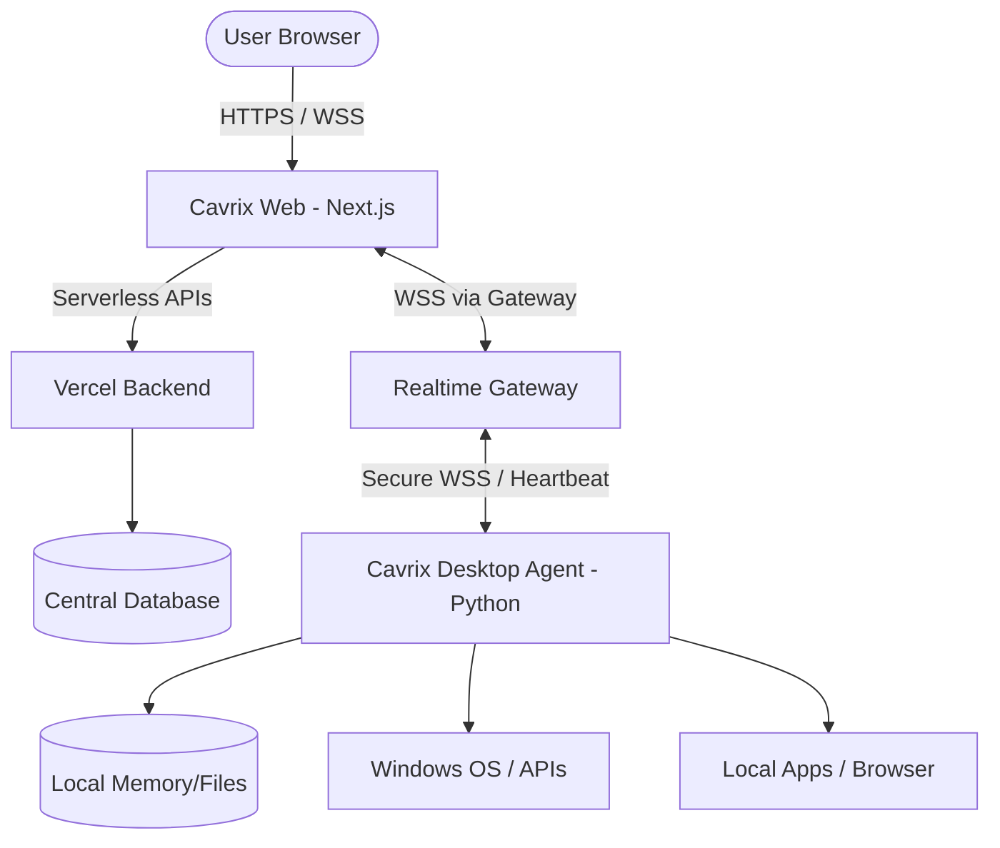

# Cavrix AI — Split Architecture

The Cavrix AI project is migrating from a monolithic desktop Python application to a distributed architecture. This document outlines the high-level system design.

## 1. System Overview

## 2. Components

### Cavrix Web (Next.js)
The primary user interface for Cavrix AI, hosted on Vercel. 
- **Stack:** Next.js, React, Tailwind CSS, TypeScript.
- **Responsibilities:**
  - Rendering the UI (Reactor animations, Chat, Settings).
  - Browser-based Audio recording/playback (Gemini Live API).
  - Connecting to the Realtime Gateway for routing commands.
  - Managing user authentication and device pairing.

### Cavrix Desktop Agent (Python)
A lightweight background service running on the user's Windows PC.
- **Stack:** Python 3.11+, Websockets, Pydantic, existing `actions/`.
- **Responsibilities:**
  - Establishing an outbound WebSocket connection to the Gateway.
  - Executing privileged local tasks (`computer_control`, `browser_automation`).
  - Handling device sensors (if local audio/vision is active).
  - Enforcing strict file, path, and command execution boundaries.

### Realtime Gateway (Node.js/Python)
A centralized WebSocket service that acts as a router between Cavrix Web and the Desktop Agent. Next.js serverless functions do not support long-lived connections, necessitating this separate service.
- **Responsibilities:**
  - Authenticating WebSocket connections using device keys and session tokens.
  - Routing messages (`COMMAND`, `TOOL_CALL`, `TOOL_RESULT`) between Web and Desktop.
  - Tracking connected devices and providing online/offline presence status.

### Shared Protocol
A strictly typed communication standard (TypeScript on the Web, Pydantic on Python) to ensure messages between all layers are validated and structured.

## 3. Communication Flow

1. **User Request:** User asks Web Cavrix to "Open Spotify".
2. **LLM Tool Call:** Web Cavrix identifies the intent and queries the Gemini LLM, which returns a `TOOL_CALL` for `open_app`.
3. **Gateway Routing:** The Web layer sends the `TOOL_CALL` message over WSS to the Realtime Gateway, addressed to the paired Desktop Agent.
4. **Execution:** The Desktop Agent receives the message, runs the `open_app` action (if permitted), and returns a `TOOL_RESULT` message back through the Gateway.
5. **Response:** Web Cavrix receives the result and provides audio/visual confirmation to the user.
